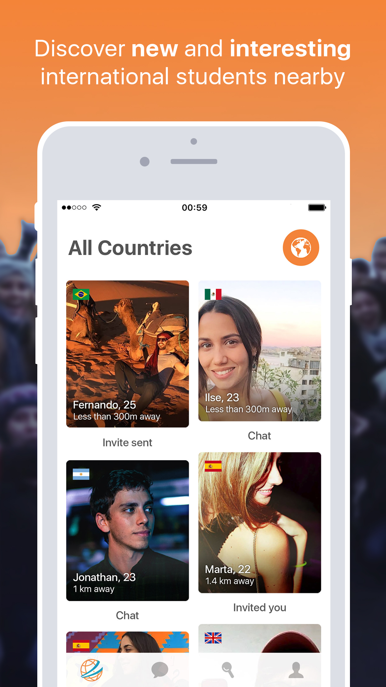
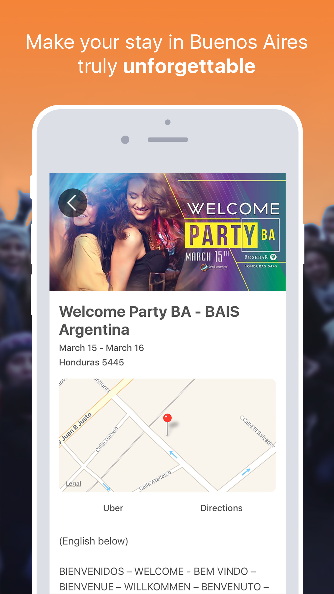

# BAIS

### Connecting students in Argentina

BAIS (acronym for Buenos Aires International Students) is the biggest exchange student NGO in Argentina. Each semester over 10.000 students from all around the world attend at least one of their events that go from roadtrips to clubbing. It is a kind of "home away from home" for this type of travelers.

The app provided a social platform from which students could meet and chat with other students residing in the same area.

